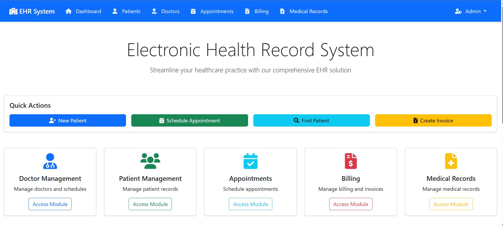

# EHR — Electronic Health Record System 🚑

[](https://github.com/)
[](LICENSE)
[](CONTRIBUTING.md)

---

> **EHR** is a full‑fledged, modular Electronic Health Record web application designed for clinics and small hospitals. It bundles patient management, clinical records, scheduling, billing, medication management, inventory, analytics and secure user access into one cohesive system.

---

## 🚀 Quick pitch

A modern, practical EHR system built to be deployed on XAMPP (Apache + PHP + MySQL). Designed for extensibility — each module is separated so you can improve, replace, or ship features independently.

---

## ✨ Key features

- ✅ Patient registration & demographic profiles
- ✅ Clinical EHR (encounters, vitals, allergies, diagnoses)
- ✅ Appointment scheduling with calendar view
- ✅ Prescription / medication management
- ✅ Billing & invoicing (invoices, payments, insurance fields)
- ✅ Inventory management (medicines & supplies)
- ✅ Clinical Decision Support (alerts, allergy checks)
- ✅ Role-based access control (Admin / Doctor / Nurse / Reception / Pharmacist / Patient)
- ✅ Reporting & analytics (visits, revenue, inventory usage)
- ✅ Patient portal (view records & download prescriptions)
- ✅ Audit logs & activity tracking for compliance

---

## 🧩 Modules (what's included)

- **Patient Information** — demographics, contacts, emergency contacts, ID documents
- **EHR / Clinical Notes** — visits, progress notes, vitals, problem lists, history
- **Appointments** — book/cancel, calendar, reminders (optional via email/SMS)
- **Billing & Payments** — services, invoices, payment records
- **Prescriptions** — create/print prescriptions, medication history
- **Inventory** — stock, reorder thresholds, supplier info
- **CDS (Clinical Decision Support)** — alerts (drug interactions, allergies)
- **Reports** — prebuilt reports + export (CSV / PDF)
- **Auth & Security** — hashed passwords, RBAC, session management
- **Admin Dashboard** — high-level KPIs and maintenance tools

---

## 🛠️ Tech stack

- **Server/Platform:** XAMPP (Apache, PHP, MySQL/MariaDB)
- **Backend:** PHP (modular controllers / MVC-like structure)
- **Frontend:** HTML5, CSS3, JavaScript (+ optionally Bootstrap or Tailwind)
- **Database:** MySQL
- **Development tools:** phpMyAdmin, Git, Composer (optional)

> _Note:_ If you prefer a different stack (Node, Java, Python, or MERN), the modular project structure makes it straightforward to swap backend layers.

---

## 📦 Getting started — Local development (fast)

### Requirements

- XAMPP (Apache + PHP 7.4+ recommended)
- MySQL / MariaDB
- Git

### Steps

```bash
# 1. Clone the repo
git clone https://github.com/<your-username>/ehr-system.git
cd ehr-system

# 2. Copy project folder into XAMPP's htdocs (or configure virtual host)
# For example (Windows): copy to C:\xampp\htdocs\ehr-system

# 3. Start Apache & MySQL via XAMPP Control Panel

# 4. Import database
# - Open phpMyAdmin and create a database named `ehr_db` (or any name you like).
# - Import `sql/ehr_schema.sql` (if provided) or run:
mysql -u root -p ehr_db < sql/ehr_schema.sql

# 5. Configure database connection
# Edit config/config.php (or .env) and set DB_HOST, DB_NAME, DB_USER, DB_PASS

# 6. Open in browser
# http://localhost/ehr-system/
```

---

## ⚙️ Example config (config/config.php)

```php
<?php
return [
  'db_host' => '127.0.0.1',
  'db_name' => 'ehr_db',
  'db_user' => 'root',
  'db_pass' => '',
  'base_url' => 'http://localhost/ehr-system'
];
```

---

## 📁 Recommended folder structure

```
/ehr-system
  /app
    /controllers
    /models
    /views
  /public
    /assets (css/js/img)
    index.php
  /config
    config.php
  /sql
    ehr_schema.sql
  /docs
  /tests
  README.md
  LICENSE
```

---

## 🔌 API — example endpoints

> These are example REST endpoints. If your app is primarily server-rendered, use the matching server routes.

| Method | Endpoint | Description |
|--------|----------|-------------|
| GET    | `/api/patients` | List patients (supports paging & filters) |
| GET    | `/api/patients/{id}` | Get single patient details |
| POST   | `/api/patients` | Create patient |
| PUT    | `/api/patients/{id}` | Update patient |
| DELETE | `/api/patients/{id}` | Soft-delete patient |
| GET    | `/api/appointments` | List appointments |
| POST   | `/api/appointments` | Create appointment |
| POST   | `/api/auth/login` | Authenticate user (returns session/token)

### Example JSON (create patient)

```json
POST /api/patients
{
  "first_name": "Aisha",
  "last_name": "Khan",
  "dob": "1990-05-12",
  "gender": "female",
  "phone": "+92-300-5555555"
}
```

---

## 🗃️ Database — core tables (short summary)

- `users` — id, username, password_hash, role, email, created_at
- `patients` — id, first_name, last_name, dob, gender, contact, address, created_at
- `encounters` — id, patient_id, clinician_id, notes, diagnosis_codes, vitals, created_at
- `appointments` — id, patient_id, clinician_id, scheduled_at, status
- `prescriptions` — id, encounter_id, medication_items (json), instructions
- `invoices` — id, patient_id, items (json), total, paid_status
- `inventory` — id, item_name, qty, reorder_level, supplier
- `audit_logs` — id, user_id, action, target_table, target_id, timestamp

> Tip: Use appropriate indexes (patient_id, clinician_id, scheduled_at) for performance.

---

## 🔒 Security best practices (do these!)

- Hash passwords with `password_hash()` (PHP) — never store plain text.
- Use prepared statements / parameterized queries to prevent SQL injection.
- Sanitize & validate user input on server-side.
- Serve the app over HTTPS in production.
- Implement role-based access controls; verify authorization for every sensitive action.
- Log important events and retain audit trails.

---

## 🧪 Testing

- Manual test cases are recommended for critical flows (login, prescriptions, billing).
- For automated tests, consider using PHPUnit for backend logic.
- Add end-to-end tests (Selenium / Cypress) for UI flows like appointment booking & invoice generation.

---

## 🧭 Deployment

- For production, use a VPS or managed host with Apache/Nginx, PHP-FPM, and MySQL.
- Move DB credentials to environment variables and disable error display.
- Configure a proper virtual host (`/etc/apache2/sites-available/your-site.conf`) and enable SSL (Let's Encrypt).

---

## 📷 Screenshots


```

```

---

## 💡 Roadmap (ideas)

- Add email/SMS appointment reminders
- Two-factor authentication (2FA)
- HL7 / FHIR interoperability for external systems
- Mobile-friendly responsive UI or a dedicated mobile app
- More advanced analytics & dashboards
- Role-specific UX improvements for clinicians vs admin vs patient

---

## 🤝 Contributing

Contributions welcome! Please:

1. Fork the repo
2. Create a feature branch
3. Open a pull request with a clear description

See `CONTRIBUTING.md` for code style, testing requirements, and commit message guidelines.

---

## 📜 License

This project is released under the **MIT License**. See `LICENSE`.

---

## ✉️ Contact

Project owner: **Obaid Ullah**

If you want help customizing this README (shorter, more concise, or targeted for a deployable README with scripts), tell me which tone and I will adjust it.

---

*Made with ❤️ for clinicians, admins, and patients.*

